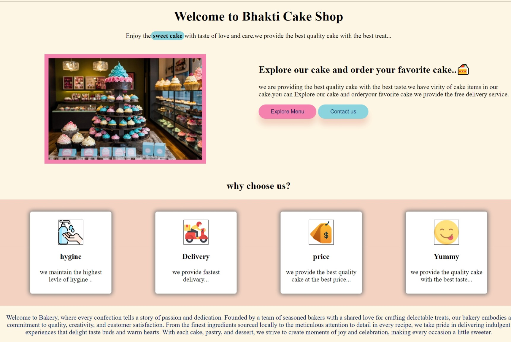
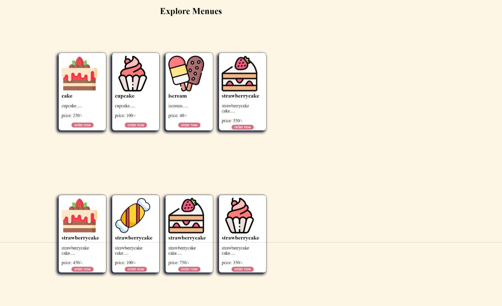
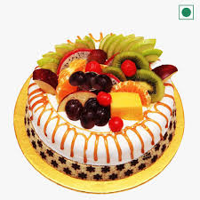

# cake shop 💹

## cake shop !

Discover the future of cakeshop shopping with Decor den, an innovative `open-source` project designed to revolutionize the way you browse, select, and purchase furniture. Built with cutting-edge web technologies like `HTML, CSS` Decor den offers a seamless and engaging user experience.

### Key Features:
- <b>beautyfull cake  </b>: Enjoy a clean, stylish `interface. that makes furniture shopping a pleasure.

- <b>new product</b>: Perfectly optimized for all devices, ensuring a smooth experience whether you’re on a desktop, tablet, or smartphone.

- <b>Home dilivery</b>: Explore a wide range of furniture categories, from contemporary to classic, all beautifully showcased with high-quality images.

- <b>various product</b>: Utilize image sliders, carousels, and detailed product views to get a closer look at your favorite pieces.

### Why Choose cake shop?
Decor den is more than just a website; it’s a community-driven platform that invites developers and designers to contribute and enhance the project. Whether you’re a cake shop enthusiast, a web developer, or a business owner, Decor den provides the tools .
Join us in transforming the furniture shopping experience. Explore, contribute, and innovate with Decor den!

## Contributors

